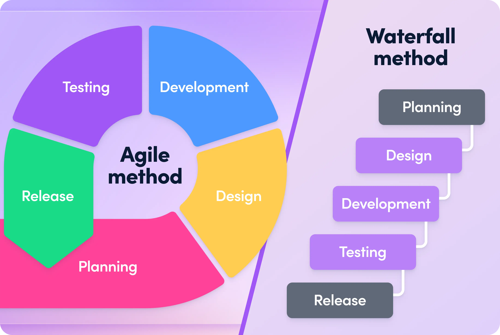

Over the course of a semester I worked on a project that required knowledge in both C and C++, that was built upon weekly bit by bit. It demonstrated the importance of Agile development, which is the process of slowly adding new code as to more easily tackle arising bugs and steadily develop a program. This project was created in a unix system and allowed a user to add, edit, delete, and genrally manage accounts and the addresses assigned to them.

Developing a large program slowly over time allowed me to create a system that was much more complex than I thought I was capable of making at the time, and showed me how to conduct my work for any future projects.

  

