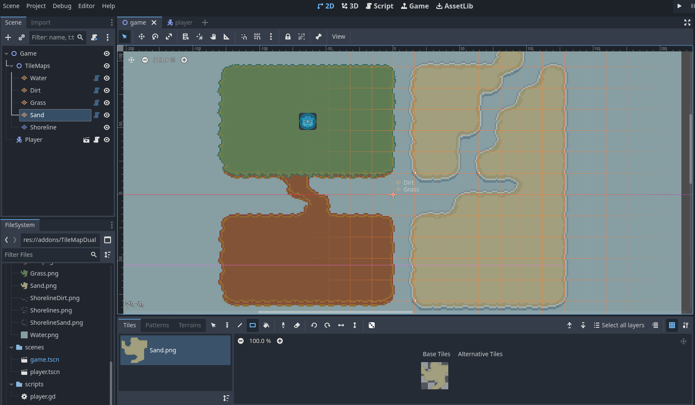

I'm currently in the process of developing games in my spare time. My plan is to build small games that contain some features of what my first "real game" would contain. This would allow me to learn more about what might help me in my future games, gain some code that could serve as the baseline to be built upon, and also divide what would be a monumental task into smaller pieces.

In doing so, I must learn about multiple aspects of game development, namely art, sound, story, music, and of course programming design. I have created some pixel art through the use of aseprite, which includes character models, tilesets, and general artworks/icons. I've recently been working on customizing a system designed for dual-grid tilemaps, which contain both a world grid and an offset display grid for seperating game logic and visuals, to allow for multiple tilemaps to overlay based on specific conditions. At the moment, I am customizing it to draw matching shoreline tiles only on sand tiles touching water, but it is still not perfect at detecting the difference. However, I have created code to automatically overlay the correct tile at its corresponding locations:

  

In the future, this code will help to overlay many other parts of the game, and can be used in many seperate ways to create a dynamically changing map.
